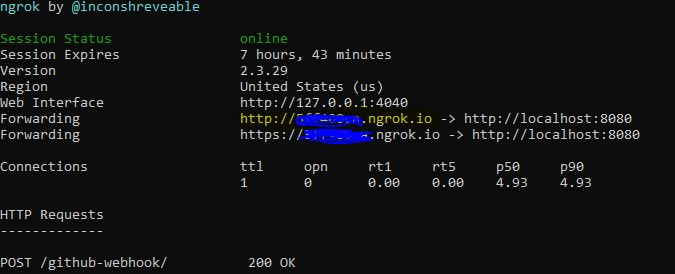

# jenkins-setup-for-test-automation

## Jenkins Install and Configure:

* Download jenkins war file from the [official site](https://jenkins.io/download/)

* Navigate to downloaded file directory in cmd and run the below to start jenkins
	○ **java -jar jenkins.war** >>>> this will start jenkins in the default port 8080
	○ If any errors with future java version in the system, 
		**§ java -jar jenkins.war --enable-future-java**

* Access jenkins page using http://localhost:8080/
	○ If we want to start jenkins in a particular port,
		**java -jar jenkins.war --enable-future-java -httpPort=9090**

* In Jenkins UI > Go To - Manage Jenkins > Global Tool Configuration > 
	○ Provide JDK home  :  Program files>Java and provide the SDK path
	○ Maven home
	
* To add new project to Jenkins - > New Item> Free style Project > Advanced settings under General > Use Customer Workspace and provide the project folder path

* To add new build to the above configured project > Same page > Build > Add build step > Invoke top level maven targets> Select the maven version
	○ Goals > Provide the corresponding maven command > test -PProgression *no need to mention mvn specifically as jenkins takes it automatically
	
## To trigger Jenkins build when code is pushed to Github

* Step 1: Go to your GitHub repository where the project is stored and click on **‘Settings’**

* Step 2: Click on Webhooks and then click on **‘Add webhook’**

* Step 3: In the **‘Payload URL’** field, paste your Jenkins environment URL. At the end of this URL add **/github-webhook/**. In the ‘Content type’ select ‘application/json’ and leave the ‘Secret’ field empty.
	
 	○ If we are using own machine to run jenkins, then updating the URL field as 'http://localhost:8080' will not work as github will not recognise this. To make this work,
            a. Download the ngrok ZIP file
            b. Unzip the ngrok.exe file
            c. Place the ngrok.exe in a folder of your choosing
            d. Make sure the folder is in your PATH environment variable
            e. Go to command prompt and run the command "ngrok.exe http 8080"
            f. The next window will show the bwlow, copy the ip address of the system             
                

	○ Now update the payload URL as 'http://<-->.ngrok.io/github-webhook/' (without 8080 port) (<--> as suggested by the system)

* Step 4: In ‘Which events would you like to trigger this webhook?’ choose ‘Let me select individual events.’ Then, check ‘Pull Requests’ and ‘Pushes’. At the end of this option, make sure that ‘Active’ is checked and click on ‘Add webhook’.

**Now configuring Jenkins :**
* Step 5: In Jenkins, click on ‘New Item’ to create a new project

* Step 6: Give your project a name, them choose ‘Freestyle project’ and finally click on ‘OK’

* Step 7: Click on the ‘Source Code Management’ tab.

* Step 8: Click on Git and paste your GitHub repository URL in the ‘Repository URL’ field.
		○ To add credential,  click on “Add” next to “Credentials” -> Select “Jenkins Credential Provider”, this will display the add credentials screen.
		○ Domain: By default “Global credentials (unrestricted)” is selected. Other option is: “Username and password”. Use default.
		○ Username – Specify the username that will be used to connect to the remote git repository. To find the username, run this command "git config --global user.name" in cmd prompt
		○ Password – Specify the password for the above username. Leave the ID and Description field empty

* Step 9: Click on the ‘Build Triggers’ tab and then on the ‘GitHub hook trigger for GITScm polling’. Or, choose the trigger of your choice.

* Step 10 : Triggering the Jenkins Job to Run with Every Code Commit - Step 10: Click on the ‘Build’ tab, then click on ‘Add build step’ and choose ‘Execute shell’.
	
### Referenced Links

 * https://www.blazemeter.com/blog/how-to-integrate-your-github-repository-to-your-jenkins-project
 * https://www.thegeekstuff.com/2016/10/jenkins-git-setup/
